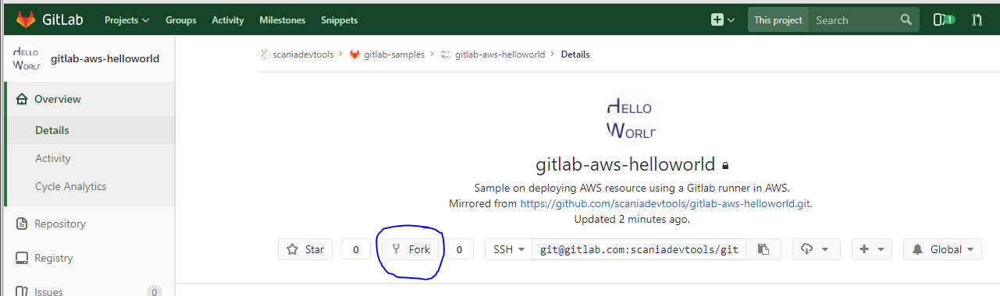
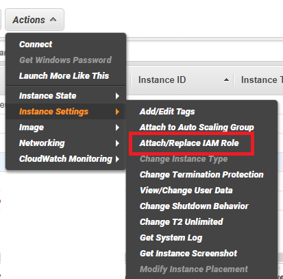
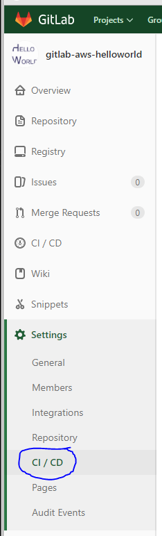
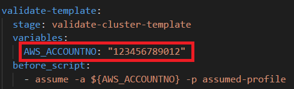

AWS deployment of HelloWorld using Gitlab runner in AWS
=======================================================

This repo demonstrates deployment of an AWS resource to AWS using a Gitlab runner in AWS. When the Gitlab pipeline is triggered an <a href="https://docs.aws.amazon.com/AmazonECS/latest/developerguide/ECS_clusters.html" target="_blank">AWS ECS Cluster</a> Cloudformation template is <a href="https://docs.aws.amazon.com/AWSCloudFormation/latest/UserGuide/using-cfn-validate-template.html" target="_blank">validated</a> and <a href="https://docs.aws.amazon.com/AWSCloudFormation/latest/UserGuide/using-cfn-cli-creating-stack.html" target="_blank">deployed</a> to a specified AWS account.


## InstallSetting up the project
### Before you start
To get this project up and running you need to have the folloing ready:
* A Gitlab runner in an AWS account that can assume another AWS role. Such a Gitlab runner can be setup from this <a href="https://github.com/scaniadevtools/gitlab-runner" target="_blank">repo.</a> 
* An AWS account (not neccessary the same account the Gitlab runner is deployed in)
* A Gitlab account so you can fork this project and make changes to the files.

### Setup and install

#### Fork the project
* In this project navigate to "Overview"
* Click on "Fork"
*
* Follow the instructions to fork the project

#### Set up permissions in AWS

* Clone the forked project to your computer

##### Set up permissions for the Gitlab runner

You need to have have assume-role permissions on your Gitlab runner host in AWS to be able to validate and create CloudFormation stacks (phew).

Your Gitlab runner host need to have ``sts:AssumeRole`` permissions. An example of such a Gitlab runner can be setup from this <a href="https://github.com/scaniadevtools/gitlab-runner" target="_blank">repo.</a>

__Important:__ We recommend naming this stack `gitlabrunner-access` because then the deployment role described below can be applied without any changes.


After having created a CloudFormation stack from this template in your AWS account you need to attach the role created by this template to your Gitlab runner host.

* In the AWS console, right-click on your Gitlab runner host EC2. Select "Instance Settings"->"Attach/Replace IAM Role" (see below)


Select the IAM Role ``gitlab-runner-GitlabRunnerInstanceProfile`` and click "Apply".

##### Set up permissions for running AWS CloudFormation 
When the Gitlab runner has permissions to assume other roles we can now create a deployment role that has permissions to do the work specified in the `.gitlab-ci.yml` file, i.e. validate and create CloudFormation templates and stacks.

By applying the `aws/helloworld-deploy-permissions.yml` in your AWS account we can do just that. There are however some things to consider before running away and do it:

1. The CloudFormation template (the deploy role) need to be the applied in the account where the resulting AWS resource should be deployed. This may or may not be  the same AWS account as the one your Gitlab runner is running in. For example, you may have your Gitlab runner host running in your *Development* account but want to deploy the AWS resources to your *Production* account. 
2. The role need to allow the Gitlab runner role (the one we created above) to assume this role so we need to get the names and references correct.
The `aws/helloworld-deploy-permissions.yml` have a reference to ``arn:aws:iam::${GitlabRunnerAccount}:role/gitlab-runner-GitlabRunnerRole`` and this arn is made up of the AWS account id and the Gitlab role we created above. If you did not follow our recommendation and named the stack above to `gitlabrunner-access` you need to change this reference accordingly (i.e. change the ``gitlabrunner-access`` part of the arn) before applying the Cloudformation template.
You can launch the stack directly in your AWS account here 
You can launch the stack here <a href="https://console.aws.amazon.com/cloudformation/home#/stacks/new?stackName=gitlabrunner-access&amp;templateURL=https://s3-eu-west-1.amazonaws.com/scaniadevtools-aws-templates/helloworld-deploy-permissions.yml" target="_blank"></a>

After creating the role using `aws/helloworld-deploy-permissions.yml` you will have a new role in your account named ``DeployRole`` with the following AWS permissions:

* cloudformation:ValidateTemplate
* cloudformation:CreateStack
* cloudformation:DescribeStacks
* ecs:DescribeClusters
* ecs:CreateCluster

Which is just what we need to start deploying resources using our Gitlab runner.


##### Attach your runner to this project
To make the runner run the contents of your `.gitlab-ci.yml` file you need to connect the runner to this project. This is done by navigating to *Settings*->*CI/CD*



Then click on the *Expand* button at the *Runner settings* section and click on *Enable for this project* next to your runner.

##### Configure the .gitlab-ci.yml to use correct AWS account
Now we are ready to configure the project pipeline to use our roles and AWS account(s).

Open the ``.gitlab-ci.yml`` in your favorite editor and change the ``AWS_ACCOUNTNO: "123456789012"`` to the account id of the AWS account where you installed the DeployRole in the previous step.



You perhaps also need to change (or remove) the tags property that is set to *vanilla* (unless your runner is tagged vanilla):
```yml
tags:
    - vanilla
```
This project pipeline requires just a basic Gitlab runner without any bells and whistles (i.e. a vanilla runner) so it should be possible to work with almost any Gitlab runner, but you need to fix the tag accordingly or otherwise the runner may not pick up these jobs.

### Test run
To fire up everything and test your new pipeline just commit your code and push it to your remote repo on Gitlab. Your pipeline should start building in a few seconds resulting in a AWS ECS Cluster named ``hello-world`` in your specified AWS account. 

__Happy Hacking__

*Scania Devtools team*


