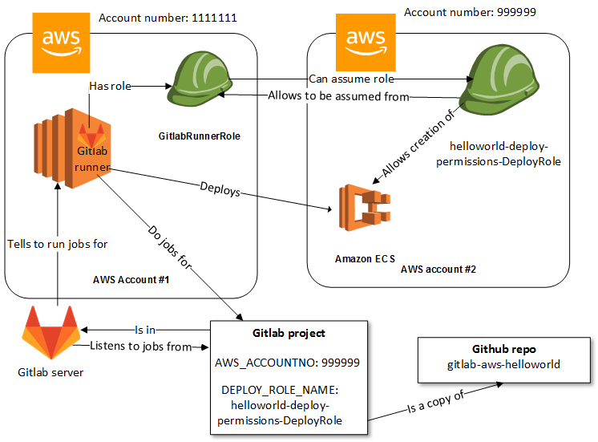
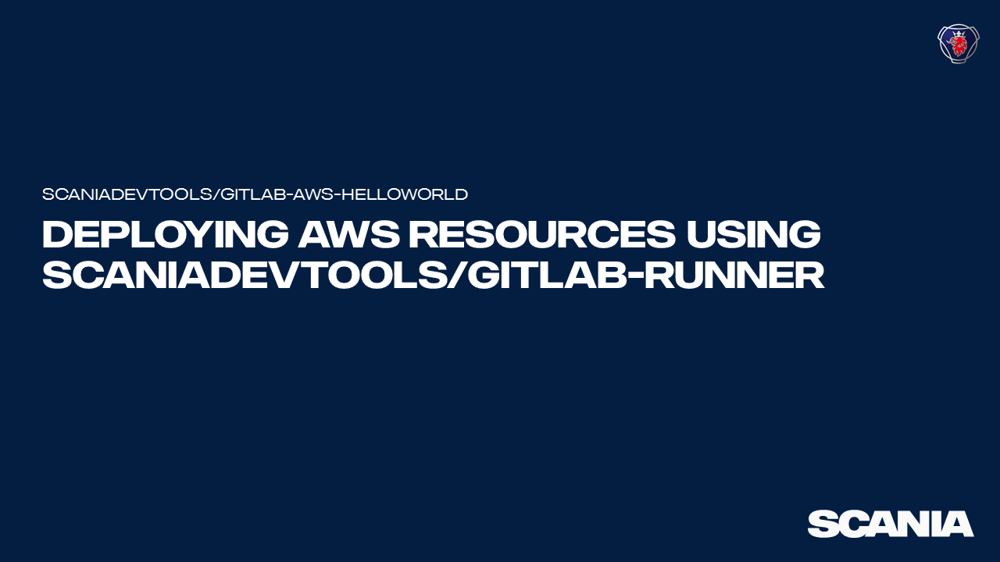
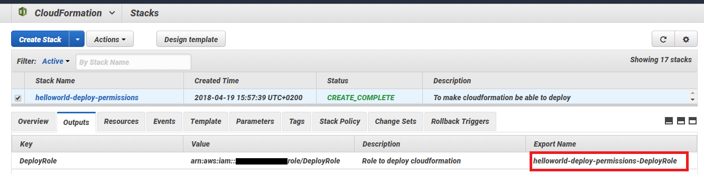
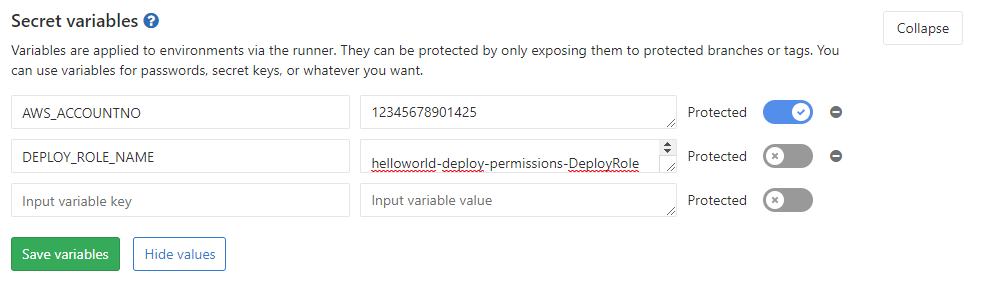
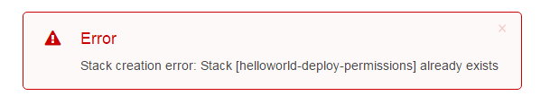
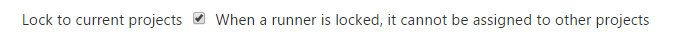
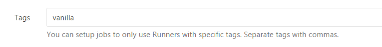
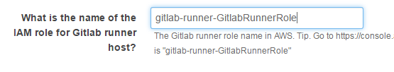
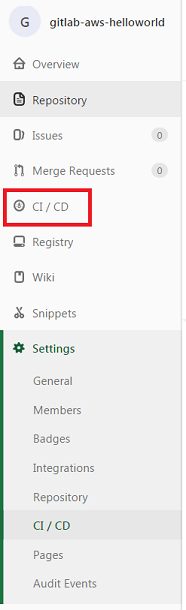

THIS REPOSITORY IS DISCONTINUED AND WILL NOT BE UPDATED ANYMORE. WE DO NOT ACCEPT ANY MORE PULL REQEUSTS. THIS RESPOSTORY WILL BE REMOVED ON MARCH 5 2019.
=================================================================================================================================

AWS deployment of HelloWorld using Gitlab runner in AWS
=======================================================

# Introduction

This repo demonstrates deployment of an AWS resource to AWS using the [Scaniadevtools Gitlab runner](https://github.com/scaniadevtools/gitlab-runner), a Gitlab runner in AWS. When a Gitlab pipeline is triggered, a Cloudformation template is <a href="https://docs.aws.amazon.com/AWSCloudFormation/latest/UserGuide/using-cfn-validate-template.html" target="_blank">validated</a> and <a href="https://docs.aws.amazon.com/AWSCloudFormation/latest/UserGuide/using-cfn-cli-creating-stack.html" target="_blank">deployed</a> to a specified AWS account creating an an <a href="https://docs.aws.amazon.com/AmazonECS/latest/developerguide/ECS_clusters.html" target="_blank">AWS ECS Cluster</a> using the Gitlab runner in AWS. 

## Purpose
The purpose of this repo is threefold:

1. To demonstrate the use of the Scaniadevtool Gitlab runner

2. Serve as a getting started guide on how to setup CI/CD project deploying resources to AWS using Gitlab and the Scaniadevtools Gitlab runner

3. To provide a working starting point that can be extended so you can hit the ground running creating your own CI/CD projects deploying resources to AWS with Gitlab and the Scaniadevtools Gitlab runner.
___
> The Gitlab runner used in the instructions below is setup from the Github repo [https://github.com/scaniadevtools/gitlab-runner](https://github.com/scaniadevtools/gitlab-runner). If you have configured your runner differently the instructions in this repo may not apply.

# Setting up this project
This section describes how to install and configure AWS, Gitlab and the Gitlab project to get a working result.
 
An advice on the road. The setup is heavily dependent on names and account numbers used for finding the right resources. Thus, read and follow the instructions carefully and make sure you spell everything exactly as stated.

If you run into trouble, take a look at the [troubleshooting section](#troubleshooting) in the Appendix.

## Outline of the end result
After following the setup instructions below you will have a copy of this repository as a Gitlab project and a working Gitlab CI/CD pipeline that has deployed a simple AWS resource to your AWS account (it will be an ECS cluster since that was the simples resource we could find to use for this purpose). The setup has also created a new role in your AWS account with permissions to deploy the ECS Cluster allowing the Gitlab runner's host's AWS IAM role to use (assume) this role and deploy to your AWS account. 

The picture shows an example of this setup where the Gitlab runner is running in account *1111111*, deploying the ECS Cluster to account *999999* as the *helloworld-deploy-permissions-DeployRole* assumed by the *GitlabRunnerRole* the Gitlab runner has.

Looks complex? Hopefully it will be much clearer when you go through the setup.

## Before you start
To run this project you should  have the following ready:

* An AWS account to deploy the cluster to. 

* A Gitlab runner in an AWS account (does not need to be the same account you deploy to). The runner should have been setup from the [Scaniadevtools gitlab-runner Github](https://github.com/scaniadevtools/gitlab-runner) repo.

* An account on the Gitlab server the runner is connected to. This can be gitlab.com or an enterprise Gitlab installation.

## Setup and install
Video demonstrating the setup and install. Click on the picture below.

### Copy this repo to your Gitlab account
Create a copy of this repo to a Gitlab project in your Gitlab account:
* In Gitlab, click "New project"
* Click the "Import project" tab
* Select "Repo by URL"
* In the "Git repository URL" enter "https://github.com/scaniadevtools/gitlab-aws-helloworld"
* Click "Create project" button at the bottom of the page.
> <a href="https://docs.gitlab.com/ee/user/project/import/repo_by_url.html" target="_blank">Read more on import project with Repo from URL</a>

### Assign the runner to the project
When the project copy is created in Gitlab we need to assign a runner to it. In the Gitlab project:
1. Click "Settings" then click "CI / CD"
2. Next to "Runner settings", click the "Expand" button 
3. Under "Available specific runners", find the runner tagged with "vanilla" and click the "Enable for this project" button.

You runner is now assigned to the project and can start picking up jobs. However, for the jobs not to fail due to insufficient permissions we need to create a deploy role in AWS. See next section.

> <a href="https://docs.gitlab.com/ee/ci/runners/#assigning-a-runner-to-another-project" target="_blank">Read more on assigning runners to project</a>

### Create the deploy role for the Gitlab runner
We will now deploy a cloudformation template in AWS that creates a role with the neccessary permissions that the Gitlab runner host can assume to be able to deploy resources to AWS for you. If you want to deploy to a different account from where your Gitlab runner is make sure you do the following steps in the correct AWS account(s).
1. Click on  (you may need to be logged in to AWS first).
2. Click "Next"
3.  On the "Specify Details" page, enter the following parameters for the stack:
    - Stack name, (defaults to `helloworld-deploy-permissions`)
    - The AWS account number where the Gitlab runner is running. Can be found at <a href="https://console.aws.amazon.com/support/home" target="_blank">https://console.aws.amazon.com/support/home</a>, under "Account number". __Note: You need to be logged in to the AWS account where the runner is to get the correct account number__.
    - The Gitlab runner role name. The name can be found in the <a href="https://console.aws.amazon.com/iam/home#/roles" target="_blank">AWS IAM console</a>. __Note: You need to be logged in to the AWS account where the runner is to find it__. **Tip**: on the IAM Console for roles, search for "*GitlabRunnerRole*".

4. Click "Next".
5. Click "Next" also on the "Options" page 
6. On the "Review" page, check the "I acknowledge that AWS CloudFormation might create IAM resources with custom names." at the bottom of the page 
7. Click "Create"
8. Wait for the stack to be created
9. When the stack is finished you should write down the name of the role that was created because we need it later. Select the newly created stack name in the Cloudformation console and select the "Outputs" tab and write down the value in the "Export Name" column for the stack.

### Setup the AWS account and role in Gitlab
We need to tell the Gitlab runner which account to deploy to and which role to assume. We do that by creating two secret variables in Gitlab.
1. In the project in Gitlab click "Settings"
2. Click "CI / CD"
3. Next to "Secret variables", click the "Expand" button
4. For the account number. In the "Input variable key" field enter "AWS_ACCOUNTNO".
5. As the "Input variable value" enter the AWS account number where you created the deploy role above. Can be found at <a href="https://console.aws.amazon.com/support/home" target="_blank">https://console.aws.amazon.com/support/home</a>, under "Account number". __Note: You need to be logged in to the AWS account where you deployed the permissions template above to get the correct account number__.
6. (Recommended) Click the "Protected" switch to avoid having the account number showing up in build logs etc.
7. In a new "Input variable key" field enter "DEPLOY_ROLE_NAME"
8. As the "Input variable value" enter the name of the IAM role we created above (the export value you wrote down). This can also be found in <a href="https://console.aws.amazon.com/iam/home#/roles" target="_blank">AWS IAM console</a>. __Note: You need to be logged in to the AWS account where you deployed the "hello-truck-ecs-deploy-permissions.yml" template to find it__. **Tip**: in the IAM Console for roles, try searching for "*DeployRole*".

Example of the secret variables setup in Gitlab:

9. Click the "Save variables" button.

## Run the deployment
Now it is time to deploy the AWS ECS cluster to your AWS account.
1. In Gitlab, click on "CI / CD" in the main menu (to the left) and then "Pipelines"
2. Click "Run Pipeline"
3. Click "Create pipeline" button on the "New Pipeline" page 
4. Lean back and wait for your Gitlab runner to deploy the ECS cluster to your AWS account.

## The end result
Logged in to AWS you can after a while follow the progress in the <a href="https://console.aws.amazon.com/cloudformation/home?#/stacks" target="_blank">Cloudformation console</a>.

While you are waiting we suggest you go back to the "Outline of the end result" section in the beginning and take a look at the visualization of your efforts in the picture agin.
 
When the stack is created you can find the Cluster in AWS by navigating to the <a href="https://console.aws.amazon.com/ecs/home?#/clusters" target="_blank">ECS console</a>.

## The next steps
Congratulations! You now have a working pipeline in Gitlab deploying resources to AWS using the Scaniadevtools runner!

Now you can play around with this project to make it setup other AWS resources for you by changing the [`gitlab-aws-helloworld.yml`](gitlab-aws-helloworld.yml) cloudformation template and when needed the [`.gitlab-ci.yml`](.gitlab-ci.yml). To make it work you also need to change the [`aws-permissions/helloworld-deploy-permissions.yml`](aws-permissions/helloworld-deploy-permissions.yml) and redeploy it to AWS to give permissions to deploy other AWS resources.

If you want to go directly to a more advanced example you can setup a complete ECS cluster with and load balancer, EC2 machines, auto-scaling, logging, Docker and some more in the [https://github.com/scaniadevtools/hello-truck-ecs](https://github.com/scaniadevtools/hello-truck-ecs) Github repo.

__Happy Hacking__

*Scania Devtools Team*

## Want to contribute?
Go to the <a href="CONTRIBUTING.md">CONTRIBUTING</a> page.

# Appendix
## Deleting
When you do not longer want your Gitlab project and AWS Cluster you can easily remove them.

Remove the ECS Cluster and the permissions stacks by the following steps when logged in to AWS:

1. Navigate to the <a href="https://console.aws.amazon.com/cloudformation/home" target="_blank">Cloudformation console</a>. 

2. Select the `gitlab-aws-helloworld` stack. 

3. Click on "Actions" followed by "Delete Stack". 

4. Repeat step 2-3 for the permissions stack.

Remove the Gitlab project by the following steps when you are logged into Gitlab:

 * For the project, click on "Settings"

 * Click "General"

 * Next to "Advanced settings", click the "Expand" button

 * Click the "Remove project" at the bottom of the page.

 * In the confirmation window, enter the project name (`gitlab-aws-helloworld`)

 * Click "Confirm"
 
## Troubleshooting

## I get "stack already exist" error when deploying the permissions file

This means that there is already a cloudformation stack deployed in your account with the same name you are trying to use. Either delete the existing stack or provide another (unique) name in the "Stack name" field for your stack. __Note__ changing the stack name effects the name of the role that is created by the stack (this name is used in later steps).

## I don't see the runner that I should assign to my Gitlab project

* You may not have setup any Gitlab runner for your account. Setup one from [https://github.com/scaniadevtools/gitlab-runner/](https://github.com/scaniadevtools/gitlab-runner/)

* The runner you have may be locked to another project. Go to the project where the runner was first created for and unlock the runner.

. 

Read more [here](https://docs.gitlab.com/ee/ci/runners/#locking-a-specific-runner-from-being-enabled-for-other-projects).

* Make sure there is a runner tagged with "vanilla". This is done in the runner settings on the project the runner was first assigned to.

## I get (AccessDenided) when running the pipeline
* You have not setup the AWS_ACCOUNTNO or DEPLOY_ROLE_NAME secret variables correctly. Check spelling, account number and role name. 
* The permissions file was not deployed correctly, check the Cloudformation Stack creation events and output
* The permissions template file was deployed to the wrong AWS account. Check that it was deployed to the account where you want to deploy AWS resources
* The account no in the secret variable value is not the one the permission template file was deployed to. Check that the AWS_ACCOUNTNO variable value is the account number where you deployed the permissions template file to.
* The Gitlab runner IAM role name provided for the permission stack creation is not correct. Check that the role name provided when creating the stack was correctly spelled and contains only the name and not e.g. the full ARN.

##  When to run the deployment I can't find any "Pipelines" menu in the CI /CD section
You are looking in the "Settings" menu and not the "CI /CD" menu. Look to the far left of the browser window, approximately in the middle of all the menues.

## I get (AlreadyExistsException) when running the pipeline

You have probably run the pipeline already and then the stack is already created. Go into the AWS Cloudformation console and delete the `gitlab-aws-helloworld` stack before you run the pipeline. 

## References

More on [AWS ECS](https://docs.aws.amazon.com/AmazonECS/latest/developerguide/Welcome.html)

The [Scaniadevtools Gitlab runner](https://github.com/scaniadevtools/gitlab-runner)

The Docker image used in the `.gitlab-ci.yml` file for deployment can be found at [https://github.com/scaniadevtools/aws-deployer](https://github.com/scaniadevtools/aws-deployer)

[Gitlab runners](https://docs.gitlab.com/runner/)

[Using .gitlab-ci.yml](https://docs.gitlab.com/ee/ci/yaml/)

